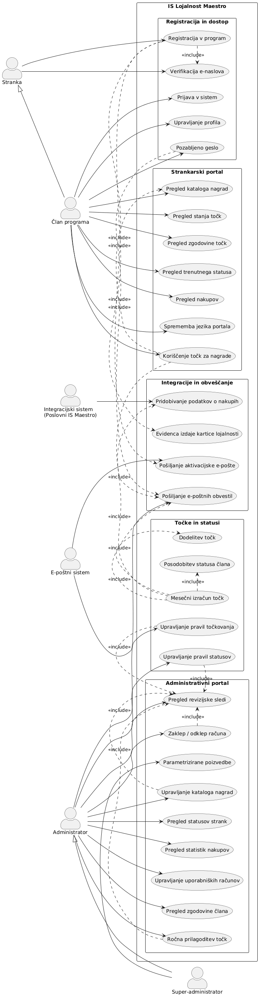
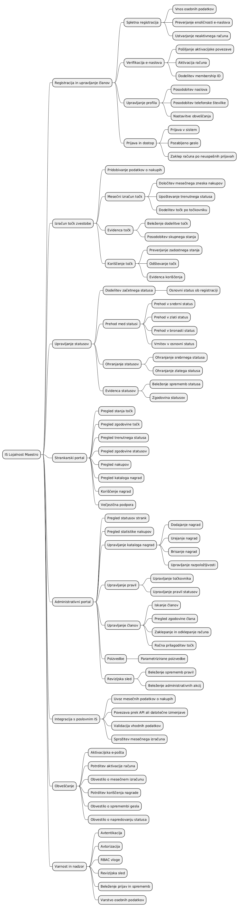
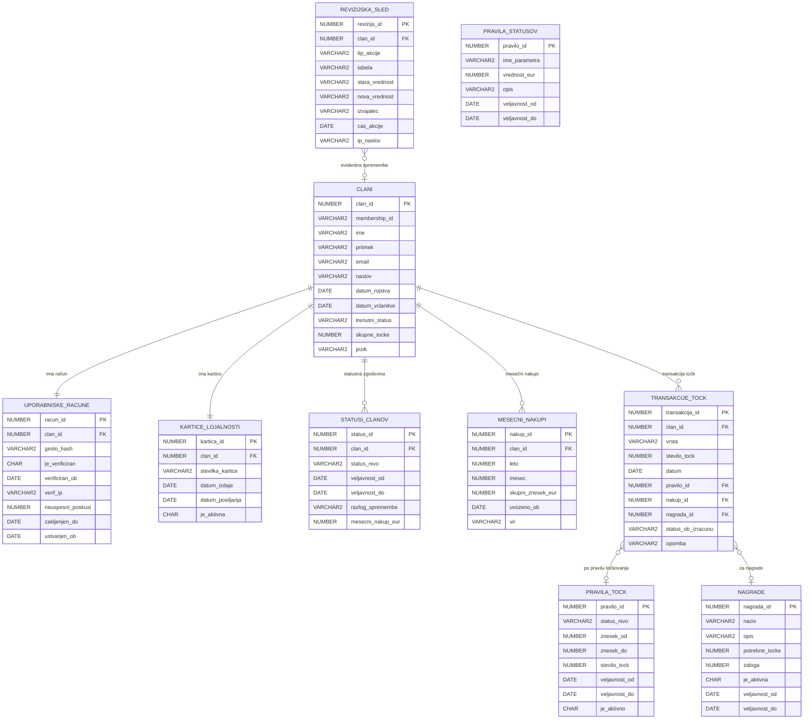

# Specifikacija zahtev programske opreme (SRS)
## Informacijski sistem za podporo programu lojalnosti — Trgovska veriga Maestro

---

| Atribut | Vrednost |
|---|---|
| **Verzija dokumenta** | 1.0 |
| **Datum** | 2026-03-25 |
| **Status** | Osnutek |
| **Standard** | IEEE 830 / ISO/IEC/IEEE 29148:2018 |

---

## Kazalo vsebine

1. [Kratek opis sistema](#1-kratek-opis-sistema)
2. [Funkcionalne zahteve](#2-funkcionalne-zahteve)
   - 2.1 Registracija in upravljanje članov
   - 2.2 Izračun točk zvestobe
   - 2.3 Upravljanje statusov
   - 2.4 Strankarski portal
   - 2.5 Administrativni portal
   - 2.6 Integracija s poslovnim IS
3. [Tehnične zahteve](#3-tehnicne-zahteve)
   - 3.1 Zmogljivost in razširljivost
   - 3.2 Varnost
   - 3.3 Zanesljivost in razpoložljivost
   - 3.4 Vzdrževanje in prilagodljivost
   - 3.5 Tehnološki sklad
4. [Vmesniki](#4-vmesniki)
   - 4.1 Uporabniški vmesnik
   - 4.2 Programski vmesnik (API)
   - 4.3 Vmesnik s podatkovno bazo
   - 4.4 Vmesnik s poslovnim IS
   - 4.5 Vmesniki za obveščanje
5. [Slovar izrazov](#5-slovar-izrazov)
6. [Reference](#6-reference)

---

## 1. Kratek opis sistema

### 1.1 Namen in obseg

Informacijski sistem za podporo programu lojalnosti Maestro (v nadaljevanju **IS Lojalnost**) je spletna aplikacija, ki omogoča upravljanje večnivojskega programa zvestobe za stranke trgovske verige Maestro. Sistem je namenjen spodbujanju ponovnih nakupov, nagrajevanju zvestih strank ter zagotavljanju analitičnih vpogledov za upravljavce programa.

IS Lojalnost vključuje dve ključni komponenti:

- **Strankarski portal** — spletna aplikacija za člane programa, dostopna prek brskalnika
- **Administrativni portal** — orodje za upravljanje programa in nadzor nad strankami

Sistem se integrira z obstoječim poslovnim informacijskim sistemom (IS) trgovske verige za pridobivanje podatkov o nakupih.

### 1.2 Kontekst sistema

```
┌─────────────────────────────────────────────────────────────────┐
│                      IS Lojalnost Maestro                       │
│                                                                 │
│  ┌──────────────────────┐    ┌───────────────────────────────┐  │
│  │  Strankarski portal  │    │    Administrativni portal     │  │
│  │  - Pregled točk      │    │  - Upravljanje strank         │  │
│  │  - Koriščenje točk   │    │  - Statistike in poizvedbe    │  │
│  │  - Pregled nakupov   │    │  - Upravljanje pravil         │  │
│  └──────────┬───────────┘    └───────────────┬───────────────┘  │
│             │                                │                   │
│  ┌──────────▼────────────────────────────────▼───────────────┐  │
│  │                 Aplikacijski strežnik                      │  │
│  │       (Poslovna logika, pravila, izračuni točk)            │  │
│  └──────────────────────────┬────────────────────────────────┘  │
│                             │                                    │
│  ┌──────────────────────────▼────────────────────────────────┐  │
│  │                Oracle podatkovna baza                      │  │
│  └───────────────────────────────────────────────────────────┘  │
└──────────────────────────────┬──────────────────────────────────┘
                               │ API
               ┌───────────────▼───────────────┐
               │       Poslovni IS Maestro      │
               │   (Podatki o nakupih strank)   │
               └───────────────────────────────┘
```

### 1.3 Ključne značilnosti

- **Večnivojski status** (osnovni → bronasti → srebrni → zlati) z dinamičnim prehajanjem
- **Mesečni izračun točk** na podlagi zneska nakupov in trenutnega statusa stranke
- **Spletna registracija** z varno verifikacijo e-naslova
- **Večjezična podpora** (slovenščina in angleščina)
- **Skalabilnost** za 500.000+ uporabnikov z možnostjo mednarodne razširitve
- **Oracle podatkovna baza** kot osnova za persistenco podatkov
- **Fleksibilna pravila** — administratorji lahko prilagajajo vrednosti točkovnika in mejna vrednosti statusov brez poseganja v kodo

### 1.4 Ciljni uporabniki

| Vrsta uporabnika | Opis |
|---|---|
| **Član programa** | Stranka Maestra, ki je včlanjena v program lojalnosti |
| **Administrator** | Zaposleni v Maestru, ki upravlja program |
| **Super-administrator** | IT skrbnik z dostopom do vseh konfiguracij in poizvedb |
| **Integracijski sistem** | Poslovni IS Maestro (strojni dostop prek API) |

---

## 2. Funkcionalne zahteve

> Vsaka zahteva je označena z unikatnim identifikatorjem v obliki `FR-XX-YY`, kjer `XX` označuje kategorijo in `YY` zaporedno številko.

---

### 2.1 Registracija in upravljanje članov

#### FR-REG-01 — Spletna registracija

**Opis:** Sistem mora omogočati, da se vsaka oseba kadarkoli registrira v program lojalnosti prek spletnega obrazca.

**Vhodi:**
- Ime in priimek
- Datum rojstva
- E-poštni naslov
- Naslov za dostavo kartice (ulica, poštna številka, kraj, država)
- Geslo (z zahtevami za moč gesla)
- Privolitev v pogoje programa (GDPR)

**Obdelava:**
1. Sistem preveri, da e-naslov še ni registriran v sistemu.
2. Sistem ustvari neaktivni račun in pošlje e-poštno sporočilo z aktivacijsko povezavo.
3. Po kliku na aktivacijsko povezavo (veljavnost 24 ur) se račun aktivira.
4. Sistem ustvari enoličen identifikator člana (membership ID).
5. Sistem sproži postopek tiskanja in pošiljanja kartice lojalnosti na navedeni naslov.

**Izhodi:**
- Potrditveno e-poštno sporočilo z navodili
- Aktiviran uporabniški račun po verifikaciji
- Kartica lojalnosti poslana po navadni pošti

**Omejitve:**
- En e-naslov = en račun (sistem zavrne podvojene e-naslove)
- Aktivacijska povezava poteče v 24 urah

**Prioriteta:** Visoka

---

#### FR-REG-02 — Verifikacija e-naslova

**Opis:** Sistem mora zagotoviti, da se stranka ne more registrirati z e-naslovom, ki ni njen.

**Obdelava:**
1. Po vnosu e-naslova sistem pošlje verifikacijsko e-pošto z unikatnim žetonom (token).
2. Račun ostane neaktiven, dokler stranka ne klikne na verifikacijsko povezavo.
3. Žeton je enkratno-uporaben in kriptografsko podpisan (npr. JWT ali HMAC).
4. Sistem beleži čas in IP naslov verifikacije.

**Prioriteta:** Visoka

---

#### FR-REG-03 — Prijava v sistem

**Opis:** Sistem mora omogočati prijavo članu s kombinacijo e-naslova in gesla.

**Obdelava:**
1. Sistem preveri veljavnost kombinacije e-naslov + geslo (bcrypt hash primerjava).
2. Po uspešni prijavi sistem ustvari sejni žeton (JWT).
3. Po 5 neuspešnih poskusih sistem začasno zaklene račun za 15 minut.

**Prioriteta:** Visoka

---

#### FR-REG-04 — Upravljanje profila

**Opis:** Član mora imeti možnost posodobitve svojih osebnih podatkov.

**Spremenljivi podatki:** naslov, telefonska številka, nastavitve obveščanja.  
**Nespremenljivi podatki:** e-naslov (zahteva posebni postopek), datum rojstva.

**Prioriteta:** Srednja

---

#### FR-REG-05 — Pozabljeno geslo

**Opis:** Sistem mora ponuditi možnost ponastavitve gesla prek e-naslova.

**Obdelava:** Sistem pošlje enkratno povezavo za ponastavitev gesla, veljavno 1 uro.

**Prioriteta:** Visoka

---

### 2.2 Izračun točk zvestobe

#### FR-PTS-01 — Mesečni izračun točk

**Opis:** Sistem mora enkrat mesečno (za pretekli mesec) izračunati točke zvestobe za vsakega aktivnega člana.

**Vhodi:** Skupni znesek nakupov člana v preteklem mesecu (iz poslovnega IS), trenutni status člana.

**Obdelava:**

1. Sistem najprej posodobi status stranke (gl. FR-STS-*).
2. Nato dodeli točke po naslednji tabeli:

| Znesek nakupov | Status: Osnovni | Status: Bronasti | Status: Srebrni | Status: Zlati |
|---|---|---|---|---|
| Do 200 EUR | 5 točk | 0 točk | 7,5 točk | 10 točk |
| 200 EUR – 1.000 EUR | 10 točk | 5 točk | 15 točk | 20 točk |
| Nad 1.000 EUR | 20 točk | 10 točk | 30 točk | 40 točk |

3. Sistem beleži vsak dodelitev točk z datumom, zneskom nakupov in statusom.
4. Točke se seštejejo k skupnemu stanju točk na računu.

**Omejitve:**
- Vrednosti v tabeli morajo biti spremenljive s strani administratorja brez posega v kodo.
- Mejne vrednosti zneskov (200 EUR, 1.000 EUR) morajo biti prav tako nastavljive.

**Prioriteta:** Visoka

---

#### FR-PTS-02 — Koriščenje točk

**Opis:** Član mora imeti možnost koriščenja zbranih točk za nagrade iz kataloga nagrad.

**Vhodi:** Izbrana nagrada iz kataloga, zadostno stanje točk.

**Obdelava:**
1. Sistem preveri, ali ima član dovolj točk za izbrano nagrado.
2. Sistem odšteje ustrezno število točk in evidentira transakcijo koriščenja.
3. Sistem sproži postopek za zagotovitev nagrade (digitalna ali fizična nagrada).

**Izhodi:** Potrditev koriščenja, posodobljeno stanje točk.

**Prioriteta:** Visoka

---

#### FR-PTS-03 — Pregled zgodovine točk

**Opis:** Član mora imeti pregled celotne zgodovine pridobivanja in koriščenja točk.

**Prikazani podatki:** datum, vrsta transakcije (pridobitev/koriščenje), število točk, opis, skupno stanje.

**Prioriteta:** Srednja

---

### 2.3 Upravljanje statusov

#### FR-STS-01 — Začetni status

**Opis:** Vsaka na novo včlanjena stranka dobi status **Osnovni**.

**Prioriteta:** Visoka

---

#### FR-STS-02 — Prehod v status Srebrni

**Opis:** Ko stranka prvič preseže znesek nakupov **499 EUR** v enem mesecu, pridobi status **Srebrni**.

**Pogoj:** Znesek nakupov v tekočem mesecu > 499 EUR IN stranka še nima statusa Srebrni ali višje.

**Prioriteta:** Visoka

---

#### FR-STS-03 — Prehod v status Zlati

**Opis:** Ko stranka s statusom Srebrni še **dvakrat** preseže 500 EUR v enem mesecu, pridobi status **Zlati**.

**Pogoj:** Stranka ima status Srebrni IN je vsaj dvakrat (ne nujno zaporedoma) v mesecih po pridobitvi Srebrnega statusa presegla 500 EUR.

**Prioriteta:** Visoka

---

#### FR-STS-04 — Ohranjanje statusa Srebrni

**Opis:** Za ohranitev statusa Srebrni mora mesečni znesek nakupov znašati vsaj **200 EUR**.

**Posledica neizpolnitve:** Če stranka dva meseca zapored ne doseže 200 EUR, pridobi status **Bronasti**.

**Prioriteta:** Visoka

---

#### FR-STS-05 — Ohranjanje statusa Zlati

**Opis:** Za ohranitev statusa Zlati mora mesečni znesek nakupov znašati vsaj **500 EUR**.

**Posledica neizpolnitve:**
- Ob prvem mesecu brez pogoja → stranka ohrani Zlati status (opozorilo).
- Ob drugem mesecu brez pogoja → stranka prejme status **Srebrni**.

**Prioriteta:** Visoka

---

#### FR-STS-06 — Status Bronasti in izhod iz njega

**Opis:** Stranka v statusu **Bronasti** ostane, dokler ne izpolni enega od naslednjih pogojev:

- **Dva zaporedna meseca** z nakupi ≥ 200 EUR → stranka pridobi status **Srebrni**.
- **Nakup pod 50 EUR** v kateremkoli mesecu → stranka se vrne v status **Osnovni**.

**Prioriteta:** Visoka

---

#### FR-STS-07 — Vrstni red operacij pri mesečnem izračunu

**Opis:** Pri mesečnem izračunu mora sistem vedno najprej posodobiti status, šele nato dodeliti točke.

**Zaporedje:**
1. Pridobi znesek nakupov za pretekli mesec.
2. Posodobi status stranke glede na pravila prehajanja.
3. Dodeli točke glede na **novi** (posodobljeni) status.

**Prioriteta:** Visoka

---

#### FR-STS-08 — Nastavljiva pravila statusov

**Opis:** Mejne vrednosti za prehajanje med statusi morajo biti nastavljive prek administrativnega vmesnika brez posega v aplikacijsko kodo.

**Nastavljivi parametri (primeri):**
- Minimalni znesek za prehod v Srebrni (privzeto: 499 EUR)
- Minimalni znesek za ohranitev Srebrnega (privzeto: 200 EUR)
- Minimalni znesek za ohranitev Zlatega (privzeto: 500 EUR)
- Mejni znesek za vrnitev v Osnovni iz Bronastega (privzeto: 50 EUR)
- Število mesecev za ohranjanje statusa pred degradacijo

**Prioriteta:** Visoka

---

### 2.4 Strankarski portal

#### FR-POR-01 — Pregled stanja točk

**Opis:** Prijavljen član mora imeti možnost vpogleda v:
- Skupno število zbranih točk
- Trenutni status lojalnosti
- Grafični prikaz napredka do naslednjega statusa
- Datum naslednjega mesečnega izračuna

**Prioriteta:** Visoka

---

#### FR-POR-02 — Pregled zneskov nakupov

**Opis:** Član mora imeti pregled mesečnih zneskov nakupov za pretekla obdobja.

**Prikazani podatki:** Mesec, skupni znesek nakupov, pridobljene točke, status v tistem mesecu.

**Prioriteta:** Srednja

---

#### FR-POR-03 — Pregled kataloga nagrad

**Opis:** Član mora imeti dostop do kataloga nagrad, ki jih je mogoče pridobiti z točkami.

**Prikazani podatki:** Opis nagrade, potrebno število točk, razpoložljivost, kategorija.

**Prioriteta:** Srednja

---

#### FR-POR-04 — Koriščenje točk za nagrade

**Opis:** Član mora imeti možnost izbire in naročila nagrade iz kataloga neposredno prek portala.

**Prioriteta:** Visoka

---

#### FR-POR-05 — Večjezična podpora

**Opis:** Celoten strankarski portal mora biti na voljo v slovenščini in angleščini. Član izbere jezik ob registraciji, nastavitev pa lahko kadarkoli spremeni.

**Prioriteta:** Visoka

---

### 2.5 Administrativni portal

#### FR-ADM-01 — Pregled statusov strank

**Opis:** Administrator mora imeti možnost pregleda statusov vseh strank za poljubno izbrano časovno obdobje.

**Filtri:** Časovno obdobje, status, abecedni red, regija.

**Prioriteta:** Visoka

---

#### FR-ADM-02 — Pregled statistike nakupov

**Opis:** Administrator mora imeti dostop do agregiranih statistik nakupov:
- Povprečni znesek nakupa po statusu
- Porazdelitev članov po statusih
- Mesečni trend rasti programa
- Skupno število dodeljenih in koriščenih točk

**Prioriteta:** Srednja

---

#### FR-ADM-03 — Poljubne poizvedbe po podatkovni bazi

**Opis:** Super-administrator mora imeti možnost izvajanja parametriziranih poizvedb po podatkovni bazi prek grafičnega vmesnika (brez pisanja SQL neposredno).

**Opomba:** Poizvedbe morajo biti samo za branje (SELECT); urejanje podatkov prek tega vmesnika ni dovoljeno.

**Prioriteta:** Srednja

---

#### FR-ADM-04 — Upravljanje kataloga nagrad

**Opis:** Administrator mora imeti možnost:
- Dodajanja, urejanja in brisanja nagrad v katalogu
- Nastavljanja vrednosti nagrade v točkah
- Upravljanja zalog in razpoložljivosti nagrad
- Označevanja nagrad kot aktivnih ali neaktivnih

**Prioriteta:** Visoka

---

#### FR-ADM-05 — Upravljanje pravil točkovanja in statusov

**Opis:** Administrator mora imeti možnost urejanja vrednosti v tabeli točkovanja in mejnih vrednosti za prehajanje med statusi prek grafičnega vmesnika — brez posega v kodo.

**Varnostna zahteva:** Vsaka sprememba pravil mora biti evidentirana (avtor, čas, stara in nova vrednost).

**Prioriteta:** Visoka

---

#### FR-ADM-06 — Upravljanje uporabniških računov članov

**Opis:** Administrator mora imeti možnost:
- Iskanja članov po e-naslovu, imenu ali membership ID
- Pregleda celotne zgodovine točk in statusov posameznega člana
- Ročnega zaklepanja ali odklepanja računa
- Ručne prilagoditve točk (z obveznim vnosom utemeljitve)

**Prioriteta:** Srednja

---

### 2.6 Integracija s poslovnim IS

#### FR-INT-01 — Pridobivanje podatkov o nakupih

**Opis:** Sistem mora imeti mehanizem za redno (mesečno) pridobivanje agregatnih podatkov o nakupih strank iz poslovnega IS.

**Vhodi:** Zahteva za podatke za določen mesec in seznam membership ID-jev.  
**Izhodi:** Skupni znesek nakupov na posameznega člana za zahtevano obdobje.

**Obdelava:** Sistem sproži mesečni izračun točk samodejno po pridobitvi vseh podatkov.

**Prioriteta:** Visoka

---

## 3. Tehnične zahteve

### 3.1 Zmogljivost in razširljivost

#### TR-PER-01 — Sočasni uporabniki

Sistem mora podpirati vsaj **10.000 sočasnih uporabnikov** portala brez degradacije zmogljivosti.

#### TR-PER-02 — Odzivni čas

- Statične strani: odzivni čas < **2 sekundi** (95. percentil)
- Dinamične poizvedbe (pregled točk, zgodovine): < **3 sekunde** (95. percentil)
- Mesečni izračun točk za 500.000 članov: zaključen v < **4 ure**

#### TR-PER-03 — Obseg podatkov

Sistem mora podpirati vsaj **500.000 aktivnih članov**, pri čemer mora biti arhitektura zasnovana tako, da omogoča rast na **več milijonov** članov brez predelave jedra sistema (za namen mednarodnega trženja).

#### TR-PER-04 — Razširljivost arhitekture

Sistem mora biti zasnovan z možnostjo horizontalnega skaliranja aplikacijskega nivoja (npr. z uravnoteženjem obremenitve). Podatkovna baza mora podpirati particioniranje tabel za velike nabore podatkov.

---

### 3.2 Varnost

#### TR-SEC-01 — Avtentikacija

- Gesla morajo biti shranjena z algoritmom **bcrypt** (minimalni faktor: 12).
- Sejni žetoni morajo biti implementirani kot kratkoživni **JWT** (Access Token: 15 minut, Refresh Token: 7 dni).
- Sistem mora podpirati zaščito pred CSRF napadi.

#### TR-SEC-02 — Šifriranje prenosa

Vsa komunikacija med odjemalcem in strežnikom mora potekati prek **TLS 1.2 ali novejšega** (HTTPS).

#### TR-SEC-03 — Verifikacija e-naslova

Verifikacijski žeton mora biti kriptografsko naključen (minimalno 128-bitna entropija) in enkratno-uporaben.

#### TR-SEC-04 — Zaščita pred napadi

- Sistem mora implementirati **rate limiting** na prijavnem vmesniku (max. 5 poskusov / 15 minut na IP).
- Sistem mora implementirati zaščito pred SQL injection, XSS in CSRF napadi.
- Vse vhodne podatke je treba sanitizirati in validirati na strežniški strani.

#### TR-SEC-05 — Skladnost z GDPR

Sistem mora biti skladen z Uredbo (EU) 2016/679 (GDPR):
- Stranka mora izrecno privoliti v obdelavo osebnih podatkov ob registraciji.
- Sistem mora podpirati pravico do pozabe (brisanje osebnih podatkov na zahtevo).
- Sistem mora omogočati izvoz osebnih podatkov posameznika v strojno berljivi obliki.
- Dostop do osebnih podatkov mora biti evidentiran (audit log).

#### TR-SEC-06 — Nadzor dostopa

- Sistem mora implementirati **vloge** (RBAC — Role-Based Access Control): Član, Administrator, Super-administrator.
- Vsak dostop do administrativnih funkcij mora biti evidentiran z identiteto uporabnika in časovnim žigom.

---

### 3.3 Zanesljivost in razpoložljivost

#### TR-REL-01 — Razpoložljivost sistema

Sistem mora zagotavljati razpoložljivost vsaj **99,5 %** (merjeno mesečno), kar ustreza največ ~3,6 ure izpada mesečno.

#### TR-REL-02 — Varnostne kopije

- Podatkovna baza mora biti varnostno kopirana dnevno (polna kopija) in urno (inkrementalna).
- Čas obnovitve po napaki (RTO) mora biti < **4 ure**.
- Ciljna točka obnovitve (RPO) mora biti < **1 ura**.

#### TR-REL-03 — Obvladovanje napak

- Mesečni izračun točk mora biti transakcijsko varen: v primeru napake mora sistem shraniti stanje in nadaljevati od zadnjega uspešnega koraka (idempotenten izračun).
- Sistem mora zagotavljati prijazna sporočila o napakah brez razkrivanja tehničnih podrobnosti strankam.

---

### 3.4 Vzdrževanje in prilagodljivost

#### TR-MNT-01 — Nastavljiva pravila

Vsa poslovna pravila (tabela točkovanja, mejne vrednosti statusov) morajo biti shranjena v podatkovni bazi (ne v kodi) in spremenljiva prek administrativnega vmesnika.

#### TR-MNT-02 — Beleženje (logging)

Sistem mora beležiti vse ključne operacije: prijave, spremembe podatkov, dodelitve točk, koriščenja točk, spremembe pravil in administrativne akcije. Dnevniki morajo biti hranjeni vsaj **12 mesecev**.

#### TR-MNT-03 — Večjezičnost

Sistem mora biti zgrajen na osnovi i18n (internationalization) arhitekture, ki omogoča preprosto dodajanje novih jezikov brez posega v kodo aplikacije. Sprva sta podprta slovenščina (SL) in angleščina (EN).

---

### 3.5 Tehnološki sklad

#### TR-TECH-01 — Podatkovna baza

Sistem mora za primarno podatkovno shrambo uporabiti **Oracle Database** (v skladu z obstoječimi licencami).

#### TR-TECH-02 — Spletni portal

Spletni portal mora biti zgrajen z modernimi spletnimi tehnologijami:
- Odzivni dizajn (responsive design) za podporo mobilnim in namiznim napravam
- Brskalniška kompatibilnost: najnovejše različice Chrome, Firefox, Safari, Edge

#### TR-TECH-03 — Aplikacijski strežnik

Aplikacijski strežnik mora biti zasnovan na osnovi REST API arhitekture, ki omogoča ločen razvoj zaledja in čelnega sistema ter poenostavlja bodočo integracijo z mobilnimi aplikacijami ali zunanjimi sistemi.

---

## 4. Vmesniki

### 4.1 Uporabniški vmesnik (UI)

#### IF-UI-01 — Splošna načela

- Vmesnik mora biti **intuitiven** in ne sme zahtevati predhodnega usposabljanja za osnovno rabo.
- Dizajn mora slediti principom **UX dobre prakse**: jasna hierarhija informacij, vidne akcijske gumbe, smiselna povratna informacija ob napakah.
- Vmesnik mora biti **odziven** (responsive) in enako uporaben na mobilnih napravah, tablicah in namiznih računalnikih.
- Vmesnik mora podpirati **dva jezika** (SL/EN) z možnostjo preklopa brez ponovne naložitve strani.

#### IF-UI-02 — Strankarski portal — ključni zasloni

| Zaslon | Opis |
|---|---|
| Registracija | Večkoračni obrazec z validacijo v realnem času |
| Prijava | Obrazec z e-naslovom in geslom, "Pozabljeno geslo" |
| Nadzorna plošča | Stanje točk, status, napredek do naslednjega statusa |
| Zgodovina točk | Kronološki seznam transakcij točk |
| Katalog nagrad | Kartični pregled nagrad s filtriranjem |
| Profil | Upravljanje osebnih podatkov in nastavitev |

#### IF-UI-03 — Administrativni portal — ključni zasloni

| Zaslon | Opis |
|---|---|
| Pregled strank | Tabela z iskalnim filtrom in paginacijo |
| Posamezna stranka | Celotna zgodovina točk, statusov in nakupov |
| Statistike | Nadzorna plošča z grafikoni in ključnimi metrikami |
| Katalog nagrad | CRUD vmesnik za upravljanje nagrad |
| Upravljanje pravil | Obrazci za urejanje točkovnika in statusnih pragov |
| Poizvedbe | Vmesnik za gradnjo parametriziranih poizvedb |

---

### 4.2 Programski vmesnik (API)

#### IF-API-01 — REST API

Sistem mora zagotavljati interni REST API za komunikacijo med čelnim sistemom (frontend) in zalednim sistemom (backend).

**Ključne skupne točke (endpoints):**

```
POST   /api/auth/register          # Registracija novega člana
POST   /api/auth/login             # Prijava
POST   /api/auth/verify-email      # Verifikacija e-naslova
POST   /api/auth/refresh           # Osvežitev JWT žetona
POST   /api/auth/forgot-password   # Zahteva za ponastavitev gesla

GET    /api/member/me              # Podatki prijavljenega člana
GET    /api/member/points          # Stanje in zgodovina točk
GET    /api/member/purchases       # Zgodovina nakupov
POST   /api/member/redeem          # Koriščenje točk

GET    /api/rewards                # Katalog nagrad
GET    /api/rewards/:id            # Posamezna nagrada

GET    /api/admin/members          # Seznam vseh članov (admin)
GET    /api/admin/stats            # Statistike programa (admin)
PUT    /api/admin/rules/points     # Posodobitev točkovnika (admin)
PUT    /api/admin/rules/tiers      # Posodobitev statusnih pragov (admin)
```

**Format:** JSON  
**Verzioniranje:** `/api/v1/...`  
**Avtentikacija:** Bearer JWT žeton v glavi `Authorization`

---

### 4.3 Vmesnik s podatkovno bazo

#### IF-DB-01 — Oracle Database

Sistem komunicira z Oracle podatkovno bazo prek:
- Standardnega JDBC/OCI gonilnika
- Parametriziranih poizvedb (prepared statements) za zaščito pred SQL injection
- Oracle connection pool za učinkovito upravljanje povezav

**Ključne tabele (logični model):**

| Tabela | Namen |
|---|---|
| `CLANI` | Osrednja tabela članov programa |
| `STATUSI_CLANOV` | Zgodovina statusov posameznega člana |
| `TRANSAKCIJE_TOCK` | Vse transakcije pridobivanja in koriščenja točk |
| `NAKUPI_MESECNI` | Mesečni agregati nakupov (uvoženi iz poslovnega IS) |
| `NAGRADE` | Katalog nagrad |
| `PRAVILA_TOCK` | Konfigurabilna tabela točkovnika |
| `PRAVILA_STATUSOV` | Konfigurabilni pragovi za prehajanje statusov |
| `REVIZIJSKA_SLED` | Revizijski dnevnik vseh sprememb |

---

### 4.4 Vmesnik s poslovnim IS

#### IF-BIS-01 — Pridobivanje nakupnih podatkov

Sistem mora imeti dobro definiran vmesnik za uvoz mesečnih podatkov o nakupih iz poslovnega IS.

**Priporočeni pristop:** REST API ali zaščitena datotečna izmenjava (SFTP + šifriran CSV/JSON).

**Zahtevana polja:**
```json
{
  "mesec": "2026-02",
  "podatki": [
    {
      "membership_id": "MST-00123456",
      "skupni_znesek_eur": 342.50
    }
  ]
}
```

**Varnost vmesnika:**
- Vmesnik mora biti zaščiten z API ključem ali mTLS certifikatom.
- Dostop je dovoljen samo z odobrenih IP naslovov.

---

### 4.5 Vmesniki za obveščanje

#### IF-NOT-01 — E-poštno obveščanje

Sistem mora pošiljati naslednje avtomatizirane e-poštne obvestila:

| Sprožilec | Vsebina sporočila |
|---|---|
| Registracija | Dobrodošlica + aktivacijska povezava |
| Aktivacija računa | Potrditev aktivacije, navodila za prijavo |
| Mesečni izračun | Pregled točk in morebitna sprememba statusa |
| Koriščenje točk | Potrditev naročila nagrade |
| Sprememba gesla | Varnostno obvestilo |
| Napredovanje statusa | Čestitke ob napredovanju v višji status |

**Tehnična zahteva:** E-pošta mora biti poslana prek SMTP strežnika z DKIM podpisom. Sporočila morajo biti oblikovana v HTML formatu (z dostopnim navadnotekstovnim alternativom) in lokalizirana (SL/EN).

---

## 5. Slovar izrazov

| Izraz | Definicija |
|---|---|
| **Program lojalnosti** | Strukturiran sistem nagrajevanja strank za ponovne nakupe pri Maestru. |
| **Član programa** | Stranka, ki se je uspešno registrirala in aktivirala račun v programu lojalnosti. |
| **Kartica lojalnosti** | Fizična kartica z unikatno številko (membership ID), ki identificira člana pri nakupu. |
| **Membership ID** | Edinstvena identifikacijska številka člana programa (npr. MST-00123456). |
| **Status (lojalnostni nivo)** | Kategorija, ki določa prednosti in vrednost točk za posameznega člana. Možni statusi: Osnovni, Bronasti, Srebrni, Zlati. |
| **Status Osnovni** | Začetni status, ki ga dobi vsak novo vključeni član. |
| **Status Bronasti** | Kazenski status za stranke, ki dlje časa ne dosegajo minimalnih nakupnih pragov. |
| **Status Srebrni** | Vmesni napredovalni status, dosežen ob prekoračitvi 499 EUR mesečnih nakupov. |
| **Status Zlati** | Najvišji status, dosežen ob ponavljajočih se nakupih nad 500 EUR. |
| **Točke zvestobe** | Virtualna valuta, ki jo člani zbirajo z nakupi in jo koristijo za nagrade. |
| **Mesečni izračun** | Avtomatizirani postopek, ki se izvede enkrat mesečno: posodobi statuse in dodeli točke za pretekli mesec. |
| **Točkovnik** | Tabela, ki določa število točk glede na znesek nakupov in status stranke. |
| **Katalog nagrad** | Seznam nagrad, ki so na voljo za koriščenje točk lojalnosti. |
| **Koriščenje točk** | Postopek, s katerim član zamenja zbrane točke za nagrado iz kataloga. |
| **Strankarski portal** | Spletna aplikacija za člane programa, namenjena pregledu točk, nakupov in koriščenju nagrad. |
| **Administrativni portal** | Spletna aplikacija za upravljavce programa, namenjena nadzoru, statistikam in konfiguraciji pravil. |
| **Prehajanje med statusi** | Proces avtomatske spremembe lojalnostnega statusa stranke na podlagi mesečnih nakupov. |
| **Poslovni IS** | Obstoječi informacijski sistem Maestra, ki vodi evidenco vseh nakupov. |
| **JWT (JSON Web Token)** | Standardiziran kriptografski žeton za avtentikacijo in avtorizacijo v spletnih aplikacijah. |
| **GDPR** | Splošna uredba EU o varstvu osebnih podatkov (Uredba 2016/679). |
| **REST API** | Arhitekturni slog za gradnjo spletnih storitev, ki temelji na HTTP protokolu. |
| **RBAC** | Nadzor dostopa na podlagi vlog (Role-Based Access Control). |
| **bcrypt** | Kriptografski algoritem za varno shranjevanje gesel z adaptivnim faktorjem. |
| **TLS** | Transport Layer Security — protokol za šifriranje omrežne komunikacije. |
| **Rate limiting** | Tehnika omejevanja števila zahtev na strežnik v določenem časovnem oknu. |
| **i18n** | Internationalization — arhitekturni vzorec za gradnjo večjezičnih aplikacij. |
| **SRS** | Software Requirements Specification — specifikacija zahtev programske opreme. |
| **RTO** | Recovery Time Objective — cilj časa obnovitve po napaki. |
| **RPO** | Recovery Point Objective — ciljna točka obnovitve (maksimalna dovoljena izguba podatkov). |
| **Audit log / revizijska sled** | Kronološki dnevnik vseh pomembnih operacij v sistemu z identiteto akterja. |
| **SFTP** | SSH File Transfer Protocol — varni protokol za prenos datotek. |
| **mTLS** | Mutual TLS — vzajemna avtentikacija med odjemalcem in strežnikom prek digitalnih certifikatov. |

---


## 6. Diagram primerov uporabe

<p align="center">
  
</p>

---


## 7. Funkcionalna dekompozicija

<p align="center">
  
</p>


---

## 8. Opis modela

### 8.1. Ključne entitete

**CLANI** je osrednja entiteta sistema. Hrani osebne podatke člana (ime, priimek, email, naslov, datum rojstva), membership ID v obliki `MST-XXXXXXXX`, trenutni status ter skupno stanje točk. Ločena od uporabniškega računa zaradi GDPR zahtev (TR-SEC-05).

**UPORABNISKE_RACUNE** hrani izključno avtentikacijske podatke — bcrypt hash gesla (faktor ≥ 12 kot zahteva TR-SEC-01), status verifikacije emaila, čas in IP verifikacije ter datum zaklenjenosti računa (po 5 neuspešnih poskusih, FR-REG-03).

**KARTICE_LOJALNOSTI** predstavlja fizično kartico z unikatno številko, datumom izdaje in datumom pošiljanja po pošti (FR-REG-01).

**STATUSI_CLANOV** beleži celotno zgodovino statusnih sprememb — vsak prehod med statusi (osnovni → srebrni itd.) z razlogom in časovnim žigom. Nujno za FR-ADM-01 (pregled za poljubno obdobje) in revizijsko sled.

**MESECNI_NAKUPI** hrani agregate zneskov, uvožene iz poslovnega IS (IF-BIS-01). Vsebuje membership ID, leto, mesec, skupni znesek in čas uvoza. Ni vezana na posamezne blagajniške račune.

**PRAVILA_TOCK** je konfigurabilna tabela točkovnika — za vsako kombinacijo statusa in razreda zneska hrani število točk. Spremenljiva prek administrativnega vmesnika brez posega v kodo (FR-PTS-01, TR-MNT-01). Podpira veljavnost (`valid_from`/`valid_to`) za zgodovino sprememb.

**PRAVILA_STATUSOV** hrani mejne vrednosti za prehajanje med statusi (499 EUR, 200 EUR, 500 EUR, 50 EUR itd.) kot nastavljive parametre (FR-STS-08). Vsaka vrednost ima ime parametra, vrednost in opis.

**TRANSAKCIJE_TOCK** beleži vsako dodelitev in koriščenje točk — vrsta (`DODELITEV`/`KORIŠČENJE`), število točk, status ob dodelitvi, referenca na mesečni nakup ali nagrado. Skupno stanje točk je derivirano iz te tabele (FR-PTS-03).

**NAGRADE** je katalog nagrad z imenom, opisom, potrebnimi točkami, zalogo in statusom aktivnosti (FR-ADM-04). Podpira veljavnost nagrade.

**REVIZIJSKA_SLED** evidentira vse administrativne akcije in spremembe pravil — kdo, kdaj, kaj je spremenil (stara/nova vrednost). Zahtevano z FR-ADM-05 in TR-MNT-02, hranjeno vsaj 12 mesecev.

---

### 8.2. Odnosi med entitetami

| Od | Do | Kardinalnost | Opis |
|---|---|---|---|
| CLANI | UPORABNISKE_RACUNE | 1 : 1 | Vsak član ima natanko en račun |
| CLANI | KARTICE_LOJALNOSTI | 1 : 1 | Vsak član ima natanko eno kartico |
| CLANI | STATUSI_CLANOV | 1 : N | Polna statusna zgodovina člana |
| CLANI | MESECNI_NAKUPI | 1 : N | Mesečni agregati nakupov po članu |
| CLANI | TRANSAKCIJE_TOCK | 1 : N | Vse dodelitve in koriščenja točk |
| TRANSAKCIJE_TOCK | PRAVILA_TOCK | N : 1 (opcijsko) | Vsaka dodelitev po enem pravilu točkovanja |
| TRANSAKCIJE_TOCK | NAGRADE | N : 1 (opcijsko) | Pri koriščenju vezano na nagrado |
| REVIZIJSKA_SLED | CLANI | N : 1 (opcijsko) | Evidentira spremembe vezane na člana |

---

### 8.3. Posebnosti modela

- **Pravila v bazi, ne v kodi** — tabeli `PRAVILA_TOCK` in `PRAVILA_STATUSOV` imata `veljavnost_od`/`veljavnost_do`, kar omogoča sledenje zgodovini sprememb in retroaktivno analizo.
- **Status pred točkami** — tabela `TRANSAKCIJE_TOCK` hrani `status_ob_izracunu`, ker se status določi **pred** dodelitvijo točk (FR-STS-07). Kritično za pravilno revizijo.
- **Oracle-kompatibilni tipi** — `NUMBER`, `VARCHAR2`, `DATE`, `CHAR` v skladu z zahtevo TR-TECH-01.
- **Skalabilnost** — particioniranje predvideno na `MESECNI_NAKUPI` in `TRANSAKCIJE_TOCK` po letu/mesecu (TR-PER-04).
- **GDPR** — osebni podatki so v `CLANI`, ločeni od avtentikacijskih podatkov v `UPORABNISKE_RACUNE`. Podpira pravico do pozabe (TR-SEC-05).
- **Večjezičnost** — atribut `jezik` v `CLANI` hrani jezikovno nastavitev člana (i18n, TR-MNT-03).

---

## 8.4. Konceptualni diagram (Mermaid ERD)


---
## 9. Reference

1. **IEEE Std 830-1998** — IEEE Recommended Practice for Software Requirements Specifications
2. **ISO/IEC/IEEE 29148:2018** — Systems and software engineering: Life cycle processes – Requirements engineering
3. **Uredba (EU) 2016/679 (GDPR)** — Splošna uredba o varstvu podatkov, Uradni list EU, 2016
4. **Oracle Database Documentation** — https://docs.oracle.com/en/database/
5. **OWASP Top 10 (2021)** — Smernice za varnost spletnih aplikacij — https://owasp.org/Top10/
6. **Loyalty Program Trends 2026 Report** — Open Loyalty, 2025 — https://www.openloyalty.io/insider/loyalty-software-trends
7. **37 Loyalty Program Best Practices** — Antavo, 2024 — https://antavo.com/blog/loyalty-program-best-practices/
8. **RFC 7519** — JSON Web Token (JWT) — IETF, 2015
9. **RFC 8446** — The Transport Layer Security (TLS) Protocol Version 1.3 — IETF, 2018

---

*Dokument pripravljen na podlagi opisa problema trgovske verige Maestro. Specifikacija je usklajena s standardom IEEE 830 / ISO/IEC/IEEE 29148:2018 in upošteva sodobne dobre prakse razvoja programov lojalnosti.*
