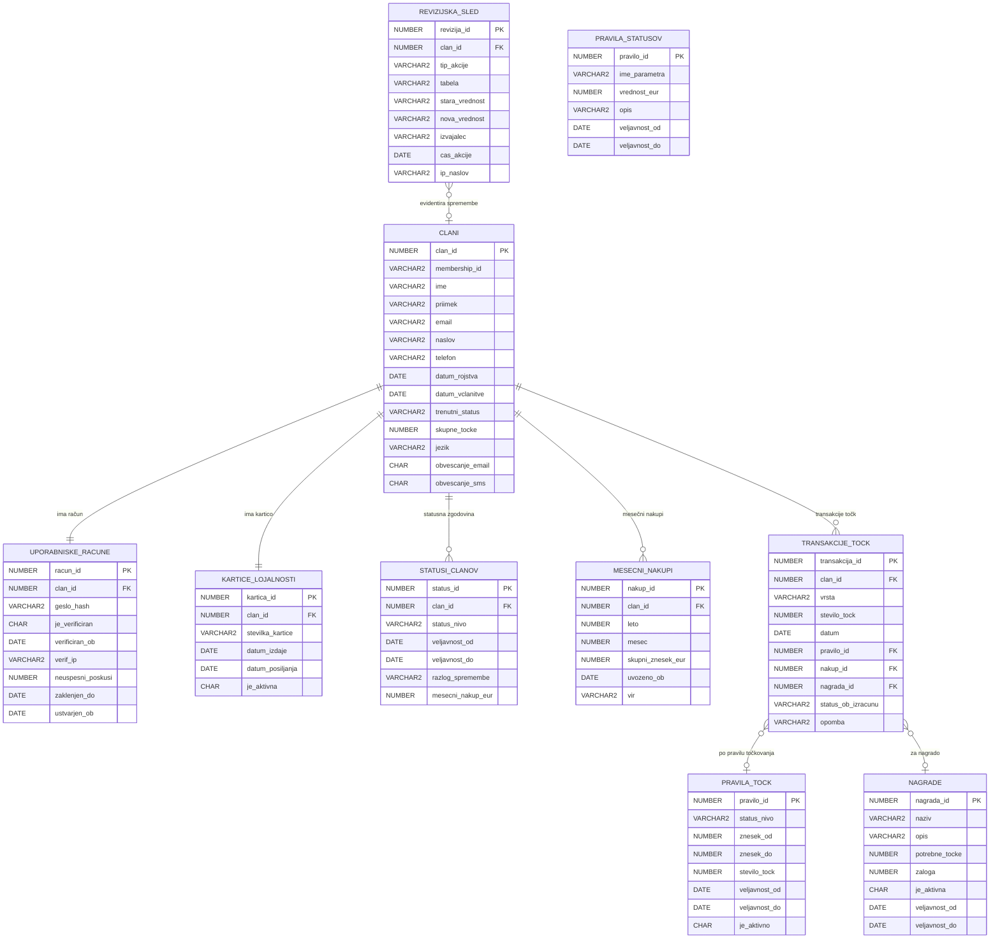

# Specifikacija zahtev programske opreme (SRS)
## Informacijski sistem za podporo programu lojalnosti — Trgovska veriga Maestro

---

| Atribut | Vrednost |
|---|---|
| **Avtor** | Daniil Sydorchuk |
| **Verzija dokumenta** | 1.0 |
| **Datum** | 2026-03-25 |
| **Status** | Osnutek |
| **Standard** | IEEE 830 / ISO/IEC/IEEE 29148:2018 |

---

## Kazalo vsebine

1. [Kratek opis sistema](#1-kratek-opis-sistema)
2. [Funkcionalne zahteve](#2-funkcionalne-zahteve)
   - 2.1 [Registracija in upravljanje članov](#21-registracija-in-upravljanje-clanov)
   - 2.2 [Izračun točk zvestobe](#22-izracun-tock-zvestobe)
   - 2.3 [Upravljanje statusov](#23-upravljanje-statusov)
   - 2.4 [Strankarski portal](#24-strankarski-portal)
   - 2.5 [Administrativni portal](#25-administrativni-portal)
   - 2.6 [Integracija s poslovnim IS](#26-integracija-s-poslovnim-is)
3. [Tehnične zahteve](#3-tehnicne-zahteve)
   - 3.1 [Zmogljivost in razširljivost](#31-zmogljivost-in-razsirljivost)
   - 3.2 [Varnost](#32-varnost)
   - 3.3 [Zanesljivost in razpoložljivost](#33-zanesljivost-in-razpolozljivost)
   - 3.4 [Vzdrževanje in prilagodljivost](#34-vzdrzevanje-in-prilagodljivost)
   - 3.5 [Tehnološki sklad](#35-tehnoloski-sklad)
4. [Vmesniki](#4-vmesniki)
   - 4.1 [Uporabniški vmesnik (UI)](#41-uporabniski-vmesnik-ui)
   - 4.2 [Programski vmesnik (API)](#42-programski-vmesnik-api)
   - 4.3 [Vmesnik s podatkovno bazo](#43-vmesnik-s-podatkovno-bazo)
   - 4.4 [Vmesnik s poslovnim IS](#44-vmesnik-s-poslovnim-is)
   - 4.5 [Vmesniki za obveščanje](#45-vmesniki-za-obvescanje)
5. [Slovar izrazov](#5-slovar-izrazov)
6. [Diagram primerov uporabe](#6-diagram-primerov-uporabe)
7. [Funkcionalna dekompozicija](#7-funkcionalna-dekompozicija)
8. [Opis modela](#8-opis-modela)
   - 8.1 [Ključne entitete](#81-kljucne-entitete)
   - 8.2 [Odnosi med entitetami](#82-odnosi-med-entitetami)
   - 8.3 [Posebnosti modela](#83-posebnosti-modela)
   - 8.4 [Konceptualni diagram (Mermaid ERD)](#84-konceptualni-diagram-mermaid-erd)
9. [Zaslonske maske](#9-zaslonske-maske)
10. [Sledljivost zahtev → funkcije → zaslonske maske → tabele podatkovnega modela](#10-sledljivost-zahtev--funkcije--zaslonske-maske--tabele-podatkovnega-modela)
11. [Reference](#11-reference)

---

## 1. Kratek opis sistema

### 1.1 Namen in obseg

Informacijski sistem za podporo programu lojalnosti Maestro (v nadaljevanju **IS Lojalnost**) je spletna aplikacija, ki omogoča upravljanje večnivojskega programa zvestobe za stranke trgovske verige Maestro. Sistem je namenjen spodbujanju ponovnih nakupov, nagrajevanju zvestih strank ter zagotavljanju analitičnih vpogledov za upravljavce programa.

IS Lojalnost vključuje dve ključni komponenti:

- **Strankarski portal** — spletna aplikacija za člane programa, dostopna prek brskalnika
- **Administrativni portal** — orodje za upravljanje programa in nadzor nad strankami

Sistem se integrira z obstoječim poslovnim informacijskim sistemom (IS) trgovske verige za pridobivanje podatkov o nakupih.

### 1.2 Kontekst sistema

```text
┌─────────────────────────────────────────────────────────────────┐
│                      IS Lojalnost Maestro                       │
│                                                                 │
│  ┌──────────────────────┐    ┌───────────────────────────────┐  │
│  │  Strankarski portal  │    │    Administrativni portal     │  │
│  │  - Pregled točk      │    │  - Upravljanje strank         │  │
│  │  - Koriščenje točk   │    │  - Statistike in poizvedbe    │  │
│  │  - Pregled nakupov   │    │  - Upravljanje pravil         │  │
│  └──────────┬───────────┘    └───────────────┬───────────────┘  │
│             │                                │                   │
│  ┌──────────▼────────────────────────────────▼───────────────┐  │
│  │                 Aplikacijski strežnik                     │  │
│  │       (Poslovna logika, pravila, izračuni točk)           │  │
│  └──────────────────────────┬────────────────────────────────┘  │
│                             │                                    │
│  ┌──────────────────────────▼────────────────────────────────┐  │
│  │                Oracle podatkovna baza                     │  │
│  └───────────────────────────────────────────────────────────┘  │
└──────────────────────────────┬──────────────────────────────────┘
                               │ API
               ┌───────────────▼───────────────┐
               │       Poslovni IS Maestro     │
               │   (Podatki o nakupih strank)  │
               └───────────────────────────────┘
```

### 1.3 Ključne značilnosti

- **Večnivojski status** (Osnovni → Bronasti → Srebrni → Zlati) z dinamičnim prehajanjem
- **Mesečni izračun točk** na podlagi zneska nakupov in trenutnega statusa stranke
- **Spletna registracija** z varno verifikacijo e-poštnega naslova
- **Večjezična podpora** (slovenščina in angleščina)
- **Skalabilnost** za 500.000+ uporabnikov z možnostjo mednarodne razširitve
- **Oracle podatkovna baza** kot osnova za persistenco podatkov
- **Fleksibilna pravila** — administratorji lahko prilagajajo vrednosti točkovnika in mejne vrednosti statusov brez poseganja v kodo

### 1.4 Ciljni uporabniki

| Vrsta uporabnika | Opis |
|---|---|
| **Član programa** | Stranka Maestra, ki je včlanjena v program lojalnosti |
| **Administrator** | Zaposleni v Maestru, ki upravlja program |
| **Super-administrator** | IT skrbnik z dostopom do vseh konfiguracij in poizvedb |
| **Integracijski sistem** | Poslovni IS Maestro (strojni dostop prek API) |

---

## 2. Funkcionalne zahteve

> Vsaka zahteva je označena z unikatnim identifikatorjem v obliki `FR-XX-YY`, kjer `XX` označuje kategorijo in `YY` zaporedno številko.

---

### 2.1 Registracija in upravljanje članov

#### FR-REG-01 — Spletna registracija

**Opis:** Sistem mora omogočati, da se vsaka oseba kadarkoli registrira v program lojalnosti prek spletnega obrazca.

**Vhodi:**
- Ime in priimek
- Datum rojstva
- E-poštni naslov
- Naslov za dostavo kartice (ulica, poštna številka, kraj, država)
- Telefonska številka
- Geslo (z zahtevami za moč gesla)
- Privolitev v pogoje programa (GDPR)
- Izbira jezika portala

**Obdelava:**
1. Sistem preveri, da e-poštni naslov še ni registriran v sistemu.
2. Sistem ustvari neaktivni račun in pošlje e-poštno sporočilo z aktivacijsko povezavo.
3. Po kliku na aktivacijsko povezavo z veljavnostjo 24 ur se račun aktivira.
4. Sistem ustvari enoličen identifikator člana (membership ID).
5. Sistem sproži postopek tiskanja in pošiljanja kartice lojalnosti na navedeni naslov.

**Izhodi:**
- Potrditveno e-poštno sporočilo z navodili
- Aktiviran uporabniški račun po verifikaciji
- Kartica lojalnosti poslana po navadni pošti

**Omejitve:**
- En e-poštni naslov = en račun
- Aktivacijska povezava poteče v 24 urah

**Prioriteta:** Visoka

---

#### FR-REG-02 — Verifikacija e-poštnega naslova

**Opis:** Sistem mora zagotoviti, da se stranka ne more registrirati z e-poštnim naslovom, ki ni njen.

**Obdelava:**
1. Po vnosu e-poštnega naslova sistem pošlje verifikacijsko e-pošto z unikatnim žetonom.
2. Račun ostane neaktiven, dokler stranka ne klikne na verifikacijsko povezavo.
3. Žeton je enkratno uporaben in kriptografsko podpisan.
4. Sistem beleži čas in IP naslov verifikacije.

**Prioriteta:** Visoka

---

#### FR-REG-03 — Prijava v sistem

**Opis:** Sistem mora omogočati prijavo članu s kombinacijo e-poštnega naslova in gesla.

**Obdelava:**
1. Sistem preveri veljavnost kombinacije e-poštni naslov + geslo z bcrypt primerjavo.
2. Po uspešni prijavi sistem ustvari sejni žeton JWT.
3. Po 5 neuspešnih poskusih sistem začasno zaklene račun za 15 minut.

**Prioriteta:** Visoka

---

#### FR-REG-04 — Upravljanje profila

**Opis:** Član mora imeti možnost posodobitve svojih osebnih podatkov.

**Spremenljivi podatki:**
- naslov
- telefonska številka
- nastavitve obveščanja
- jezik portala

**Nespremenljivi podatki:**
- e-poštni naslov (zahteva posebni postopek)
- datum rojstva

**Prioriteta:** Srednja

---

#### FR-REG-05 — Pozabljeno geslo

**Opis:** Sistem mora ponuditi možnost ponastavitve gesla prek e-poštnega naslova.

**Obdelava:** Sistem pošlje enkratno povezavo za ponastavitev gesla, veljavno 1 uro.

**Prioriteta:** Visoka

---

### 2.2 Izračun točk zvestobe

#### FR-PTS-01 — Mesečni izračun točk

**Opis:** Sistem mora enkrat mesečno za pretekli mesec izračunati točke zvestobe za vsakega aktivnega člana.

**Vhodi:**
- Skupni znesek nakupov člana v preteklem mesecu iz poslovnega IS
- Trenutni status člana

**Obdelava:**
1. Sistem najprej posodobi status stranke.
2. Nato dodeli točke po naslednji tabeli:

| Znesek nakupov | Status: Osnovni | Status: Bronasti | Status: Srebrni | Status: Zlati |
|---|---:|---:|---:|---:|
| Do 200 EUR | 5 točk | 0 točk | 7,5 točk | 10 točk |
| Več kot 200 EUR do 1.000 EUR | 10 točk | 5 točk | 15 točk | 20 točk |
| Več kot 1.000 EUR | 20 točk | 10 točk | 30 točk | 40 točk |

3. Sistem beleži vsako dodelitev točk z datumom, zneskom nakupov in statusom.
4. Točke se prištejejo k skupnemu stanju točk na računu.

**Omejitve:**
- Vrednosti v tabeli morajo biti spremenljive s strani administratorja brez posega v kodo.
- Mejne vrednosti zneskov morajo biti prav tako nastavljive.

**Prioriteta:** Visoka

---

#### FR-PTS-02 — Koriščenje točk

**Opis:** Član mora imeti možnost koriščenja zbranih točk za nagrade iz kataloga nagrad.

**Vhodi:**
- Izbrana nagrada iz kataloga
- Zadostno stanje točk

**Obdelava:**
1. Sistem preveri, ali ima član dovolj točk za izbrano nagrado.
2. Sistem odšteje ustrezno število točk in evidentira transakcijo koriščenja.
3. Sistem sproži postopek za zagotovitev nagrade.

**Izhodi:**
- Potrditev koriščenja
- Posodobljeno stanje točk

**Prioriteta:** Visoka

---

#### FR-PTS-03 — Pregled zgodovine točk

**Opis:** Član mora imeti pregled celotne zgodovine pridobivanja in koriščenja točk.

**Prikazani podatki:**
- datum
- vrsta transakcije (pridobitev ali koriščenje)
- število točk
- opis
- skupno stanje

**Prioriteta:** Srednja

---

### 2.3 Upravljanje statusov

#### FR-STS-01 — Začetni status

**Opis:** Vsaka na novo včlanjena stranka dobi status **Osnovni**.

**Prioriteta:** Visoka

---

#### FR-STS-02 — Prehod v status Srebrni

**Opis:** Ko stranka prvič doseže mesečni znesek nakupov **vsaj 500 EUR**, pridobi status **Srebrni**.

**Pogoj:** Znesek nakupov v tekočem mesecu >= 500 EUR in stranka še nima statusa Srebrni ali višje.

**Prioriteta:** Visoka

---

#### FR-STS-03 — Prehod v status Zlati

**Opis:** Ko stranka s statusom Srebrni še **dvakrat** doseže mesečni znesek nakupov **vsaj 500 EUR**, pridobi status **Zlati**.

**Pogoj:** Stranka ima status Srebrni in je vsaj dvakrat v mesecih po pridobitvi Srebrnega statusa dosegla znesek >= 500 EUR.

**Prioriteta:** Visoka

---

#### FR-STS-04 — Ohranjanje statusa Srebrni

**Opis:** Za ohranitev statusa Srebrni mora mesečni znesek nakupov znašati vsaj **200 EUR**.

**Posledica neizpolnitve:** Če stranka dva meseca zapored ne doseže 200 EUR, pridobi status **Bronasti**.

**Prioriteta:** Visoka

---

#### FR-STS-05 — Ohranjanje statusa Zlati

**Opis:** Za ohranitev statusa Zlati mora mesečni znesek nakupov znašati vsaj **500 EUR**.

**Posledica neizpolnitve:**
- Ob prvem mesecu brez izpolnjenega pogoja stranka ohrani Zlati status in prejme opozorilo.
- Ob drugem zaporednem mesecu brez izpolnjenega pogoja stranka prejme status **Srebrni**.

**Prioriteta:** Visoka

---

#### FR-STS-06 — Status Bronasti in izhod iz njega

**Opis:** Stranka v statusu **Bronasti** ostane, dokler ne izpolni enega od naslednjih pogojev:

- dva zaporedna meseca z nakupi >= 200 EUR → stranka pridobi status **Srebrni**
- mesečni nakup < 50 EUR → stranka se vrne v status **Osnovni**

**Prioriteta:** Visoka

---

#### FR-STS-07 — Vrstni red operacij pri mesečnem izračunu

**Opis:** Pri mesečnem izračunu mora sistem vedno najprej posodobiti status, šele nato dodeliti točke.

**Zaporedje:**
1. Pridobi znesek nakupov za pretekli mesec.
2. Posodobi status stranke glede na pravila prehajanja.
3. Dodeli točke glede na novi status.

**Prioriteta:** Visoka

---

#### FR-STS-08 — Nastavljiva pravila statusov

**Opis:** Mejne vrednosti za prehajanje med statusi morajo biti nastavljive prek administrativnega vmesnika brez posega v aplikacijsko kodo.

**Nastavljivi parametri:**
- minimalni znesek za prehod v Srebrni
- minimalni znesek za ohranitev Srebrnega
- minimalni znesek za ohranitev Zlatega
- mejni znesek za vrnitev v Osnovni iz Bronastega
- število mesecev za ohranjanje statusa pred degradacijo

**Prioriteta:** Visoka

---

### 2.4 Strankarski portal

#### FR-POR-01 — Pregled stanja točk

**Opis:** Prijavljen član mora imeti možnost vpogleda v:
- skupno število zbranih točk
- trenutni status lojalnosti
- grafični prikaz napredka do naslednjega statusa
- datum naslednjega mesečnega izračuna

**Prioriteta:** Visoka

---

#### FR-POR-02 — Pregled zneskov nakupov

**Opis:** Član mora imeti pregled mesečnih zneskov nakupov za pretekla obdobja.

**Prikazani podatki:**
- mesec
- skupni znesek nakupov
- pridobljene točke
- status v tistem mesecu

**Prioriteta:** Srednja

---

#### FR-POR-03 — Pregled kataloga nagrad

**Opis:** Član mora imeti dostop do kataloga nagrad, ki jih je mogoče pridobiti s točkami.

**Prikazani podatki:**
- opis nagrade
- potrebno število točk
- razpoložljivost
- kategorija

**Prioriteta:** Srednja

---

#### FR-POR-04 — Koriščenje točk za nagrade

**Opis:** Član mora imeti možnost izbire in naročila nagrade iz kataloga neposredno prek portala.

**Prioriteta:** Visoka

---

#### FR-POR-05 — Večjezična podpora

**Opis:** Celoten strankarski portal mora biti na voljo v slovenščini in angleščini. Član izbere jezik ob registraciji, nastavitev pa lahko kadarkoli spremeni.

**Prioriteta:** Visoka

---

### 2.5 Administrativni portal

#### FR-ADM-01 — Pregled statusov strank

**Opis:** Administrator mora imeti možnost pregleda statusov vseh strank za poljubno izbrano časovno obdobje.

**Filtri:**
- časovno obdobje
- status
- abecedni red
- regija

**Prioriteta:** Visoka

---

#### FR-ADM-02 — Pregled statistike nakupov

**Opis:** Administrator mora imeti dostop do agregiranih statistik nakupov:
- povprečni znesek nakupa po statusu
- porazdelitev članov po statusih
- mesečni trend rasti programa
- skupno število dodeljenih in koriščenih točk

**Prioriteta:** Srednja

---

#### FR-ADM-03 — Poljubne poizvedbe po podatkovni bazi

**Opis:** Super-administrator mora imeti možnost izvajanja parametriziranih poizvedb po podatkovni bazi prek grafičnega vmesnika brez neposrednega pisanja SQL.

**Opomba:** Poizvedbe morajo biti samo za branje; urejanje podatkov prek tega vmesnika ni dovoljeno.

**Prioriteta:** Srednja

---

#### FR-ADM-04 — Upravljanje kataloga nagrad

**Opis:** Administrator mora imeti možnost:
- dodajanja nagrad v katalog
- urejanja nagrad
- brisanja nagrad
- nastavljanja vrednosti nagrade v točkah
- upravljanja zalog in razpoložljivosti nagrad
- označevanja nagrad kot aktivnih ali neaktivnih

**Prioriteta:** Visoka

---

#### FR-ADM-05 — Upravljanje pravil točkovanja in statusov

**Opis:** Administrator mora imeti možnost urejanja vrednosti v tabeli točkovanja in mejnih vrednosti za prehajanje med statusi prek grafičnega vmesnika brez posega v kodo.

**Varnostna zahteva:** Vsaka sprememba pravil mora biti evidentirana z avtorjem, časom ter staro in novo vrednostjo.

**Prioriteta:** Visoka

---

#### FR-ADM-06 — Upravljanje uporabniških računov članov

**Opis:** Administrator mora imeti možnost:
- iskanja članov po e-poštnem naslovu, imenu ali membership ID
- pregleda celotne zgodovine točk in statusov posameznega člana
- ročnega zaklepanja ali odklepanja računa
- ročne prilagoditve točk z obveznim vnosom utemeljitve

**Prioriteta:** Srednja

---

### 2.6 Integracija s poslovnim IS

#### FR-INT-01 — Pridobivanje podatkov o nakupih

**Opis:** Sistem mora imeti mehanizem za redno mesečno pridobivanje agregatnih podatkov o nakupih strank iz poslovnega IS.

**Vhodi:**
- zahteva za podatke za določen mesec
- seznam membership ID-jev

**Izhodi:**
- skupni znesek nakupov na posameznega člana za zahtevano obdobje

**Obdelava:** Sistem sproži mesečni izračun točk samodejno po pridobitvi vseh podatkov.

**Prioriteta:** Visoka

---

## 3. Tehnične zahteve

### 3.1 Zmogljivost in razširljivost

#### TR-PER-01 — Sočasni uporabniki

Sistem mora podpirati vsaj **10.000 sočasnih uporabnikov** portala brez degradacije zmogljivosti.

#### TR-PER-02 — Odzivni čas

- Statične strani: odzivni čas < **2 sekundi** (95. percentil)
- Dinamične poizvedbe: odzivni čas < **3 sekunde** (95. percentil)
- Mesečni izračun točk za 500.000 članov: zaključen v < **4 ure**

#### TR-PER-03 — Obseg podatkov

Sistem mora podpirati vsaj **500.000 aktivnih članov**, pri čemer mora biti arhitektura zasnovana tako, da omogoča rast na več milijonov članov brez predelave jedra sistema.

#### TR-PER-04 — Razširljivost arhitekture

Sistem mora biti zasnovan z možnostjo horizontalnega skaliranja aplikacijskega nivoja. Podatkovna baza mora podpirati particioniranje tabel za velike nabore podatkov.

---

### 3.2 Varnost

#### TR-SEC-01 — Avtentikacija

- Gesla morajo biti shranjena z algoritmom **bcrypt** z minimalnim faktorjem 12.
- Sejni žetoni morajo biti implementirani kot kratkoživni **JWT**.
- Sistem mora podpirati zaščito pred CSRF napadi.

#### TR-SEC-02 — Šifriranje prenosa

Vsa komunikacija med odjemalcem in strežnikom mora potekati prek **TLS 1.2 ali novejšega**.

#### TR-SEC-03 — Verifikacija e-poštnega naslova

Verifikacijski žeton mora biti kriptografsko naključen in enkratno uporaben.

#### TR-SEC-04 — Zaščita pred napadi

- Sistem mora implementirati **rate limiting** na prijavnem vmesniku.
- Sistem mora implementirati zaščito pred SQL injection, XSS in CSRF napadi.
- Vse vhodne podatke je treba validirati in sanitizirati na strežniški strani.

#### TR-SEC-05 — Skladnost z GDPR

Sistem mora biti skladen z Uredbo (EU) 2016/679:
- izrecna privolitev v obdelavo osebnih podatkov ob registraciji
- podpora pravici do pozabe
- možnost izvoza osebnih podatkov posameznika
- beleženje dostopa do osebnih podatkov

#### TR-SEC-06 — Nadzor dostopa

- Sistem mora implementirati **RBAC** vloge: Član, Administrator, Super-administrator.
- Vsak dostop do administrativnih funkcij mora biti evidentiran z identiteto uporabnika in časovnim žigom.

---

### 3.3 Zanesljivost in razpoložljivost

#### TR-REL-01 — Razpoložljivost sistema

Sistem mora zagotavljati razpoložljivost vsaj **99,5 %** mesečno.

#### TR-REL-02 — Varnostne kopije

- Podatkovna baza mora biti varnostno kopirana dnevno s polno kopijo in urno z inkrementalno kopijo.
- Čas obnovitve po napaki mora biti < **4 ure**.
- Ciljna točka obnovitve mora biti < **1 ura**.

#### TR-REL-03 — Obvladovanje napak

- Mesečni izračun točk mora biti transakcijsko varen in idempotenten.
- Sistem mora zagotavljati prijazna sporočila o napakah brez razkrivanja tehničnih podrobnosti.

---

### 3.4 Vzdrževanje in prilagodljivost

#### TR-MNT-01 — Nastavljiva pravila

Vsa poslovna pravila morajo biti shranjena v podatkovni bazi in spremenljiva prek administrativnega vmesnika.

#### TR-MNT-02 — Beleženje

Sistem mora beležiti:
- prijave
- spremembe podatkov
- dodelitve točk
- koriščenja točk
- spremembe pravil
- administrativne akcije

Dnevniki morajo biti hranjeni vsaj **12 mesecev**.

#### TR-MNT-03 — Večjezičnost

Sistem mora biti zgrajen na osnovi i18n arhitekture, ki omogoča dodajanje novih jezikov brez posega v kodo.

---

### 3.5 Tehnološki sklad

#### TR-TECH-01 — Podatkovna baza

Sistem mora za primarno podatkovno shrambo uporabiti **Oracle Database**.

#### TR-TECH-02 — Spletni portal

Spletni portal mora biti zgrajen z modernimi spletnimi tehnologijami:
- odzivni dizajn za mobilne in namizne naprave
- kompatibilnost z najnovejšimi različicami Chrome, Firefox, Safari in Edge

#### TR-TECH-03 — Aplikacijski strežnik

Aplikacijski strežnik mora biti zasnovan na osnovi REST API arhitekture.

---

## 4. Vmesniki

### 4.1 Uporabniški vmesnik (UI)

#### IF-UI-01 — Splošna načela

- Vmesnik mora biti intuitiven in ne sme zahtevati predhodnega usposabljanja za osnovno rabo.
- Dizajn mora slediti principom dobre UX prakse.
- Vmesnik mora biti odziven.
- Vmesnik mora podpirati dva jezika z možnostjo preklopa brez ponovne naložitve strani.

#### IF-UI-02 — Strankarski portal — ključni zasloni

| Zaslon | Opis |
|---|---|
| Registracija | Večkoračni obrazec z validacijo v realnem času |
| Prijava | Obrazec z e-poštnim naslovom in geslom ter povezavo "Pozabljeno geslo" |
| Nadzorna plošča | Stanje točk, status, napredek do naslednjega statusa |
| Zgodovina točk | Kronološki seznam transakcij točk |
| Katalog nagrad | Kartični pregled nagrad s filtriranjem |
| Profil | Upravljanje osebnih podatkov in nastavitev |

#### IF-UI-03 — Administrativni portal — ključni zasloni

| Zaslon | Opis |
|---|---|
| Pregled strank | Tabela z iskalnim filtrom in paginacijo |
| Posamezna stranka | Celotna zgodovina točk, statusov in nakupov |
| Statistike | Nadzorna plošča z grafikoni in ključnimi metrikami |
| Katalog nagrad | CRUD vmesnik za upravljanje nagrad |
| Upravljanje pravil | Obrazci za urejanje točkovnika in statusnih pragov |
| Poizvedbe | Vmesnik za gradnjo parametriziranih poizvedb |

---

### 4.2 Programski vmesnik (API)

#### IF-API-01 — REST API

Sistem mora zagotavljati interni REST API za komunikacijo med frontend in backend delom sistema.

**Ključne skupne točke:**

```text
POST   /api/v1/auth/register
POST   /api/v1/auth/login
POST   /api/v1/auth/verify-email
POST   /api/v1/auth/refresh
POST   /api/v1/auth/forgot-password

GET    /api/v1/member/me
GET    /api/v1/member/points
GET    /api/v1/member/purchases
POST   /api/v1/member/redeem

GET    /api/v1/rewards
GET    /api/v1/rewards/:id

GET    /api/v1/admin/members
GET    /api/v1/admin/stats
PUT    /api/v1/admin/rules/points
PUT    /api/v1/admin/rules/tiers
```

**Format:** JSON  
**Avtentikacija:** Bearer JWT v glavi `Authorization`

---

### 4.3 Vmesnik s podatkovno bazo

#### IF-DB-01 — Oracle Database

Sistem komunicira z Oracle podatkovno bazo prek:
- standardnega JDBC ali OCI gonilnika
- parametriziranih poizvedb
- connection pool mehanizma

**Ključne tabele logičnega modela:**

| Tabela | Namen |
|---|---|
| `CLANI` | Osrednja tabela članov programa |
| `UPORABNISKE_RACUNE` | Avtentikacijski podatki članov |
| `KARTICE_LOJALNOSTI` | Fizične kartice lojalnosti |
| `STATUSI_CLANOV` | Zgodovina statusov posameznega člana |
| `TRANSAKCIJE_TOCK` | Vse transakcije pridobivanja in koriščenja točk |
| `MESECNI_NAKUPI` | Mesečni agregati nakupov |
| `NAGRADE` | Katalog nagrad |
| `PRAVILA_TOCK` | Konfigurabilna tabela točkovnika |
| `PRAVILA_STATUSOV` | Konfigurabilni pragovi za prehajanje statusov |
| `REVIZIJSKA_SLED` | Revizijski dnevnik vseh sprememb |

---

### 4.4 Vmesnik s poslovnim IS

#### IF-BIS-01 — Pridobivanje nakupnih podatkov

Sistem mora imeti dobro definiran vmesnik za uvoz mesečnih podatkov o nakupih iz poslovnega IS.

**Priporočeni pristop:** REST API ali zaščitena datotečna izmenjava.

**Zahtevana polja:**

```json
{
  "mesec": "2026-02",
  "podatki": [
    {
      "membership_id": "MST-00123456",
      "skupni_znesek_eur": 342.50
    }
  ]
}
```

**Varnost vmesnika:**
- API ključ ali mTLS certifikat
- dostop samo z odobrenih IP naslovov

---

### 4.5 Vmesniki za obveščanje

#### IF-NOT-01 — E-poštno obveščanje

Sistem mora pošiljati naslednja avtomatizirana e-poštna obvestila:

| Sprožilec | Vsebina sporočila |
|---|---|
| Registracija | Dobrodošlica in aktivacijska povezava |
| Aktivacija računa | Potrditev aktivacije in navodila za prijavo |
| Mesečni izračun | Pregled točk in morebitna sprememba statusa |
| Koriščenje točk | Potrditev naročila nagrade |
| Sprememba gesla | Varnostno obvestilo |
| Napredovanje statusa | Čestitke ob napredovanju v višji status |

**Tehnična zahteva:** E-pošta mora biti poslana prek SMTP strežnika z DKIM podpisom in mora biti lokalizirana.

---

## 5. Slovar izrazov

| Izraz | Definicija |
|---|---|
| **Program lojalnosti** | Sistem nagrajevanja strank za ponovne nakupe pri Maestru |
| **Član programa** | Stranka, ki se je uspešno registrirala in aktivirala račun |
| **Kartica lojalnosti** | Fizična kartica z unikatno številko člana |
| **Membership ID** | Edinstvena identifikacijska številka člana |
| **Status** | Kategorija lojalnosti člana |
| **Status Osnovni** | Začetni status |
| **Status Bronasti** | Kazenski status ob neizpolnjevanju pogojev |
| **Status Srebrni** | Vmesni napredovalni status |
| **Status Zlati** | Najvišji status |
| **Točke zvestobe** | Virtualna valuta za nagrade |
| **Mesečni izračun** | Postopek posodobitve statusov in dodelitve točk |
| **Točkovnik** | Tabela za določanje števila točk |
| **Katalog nagrad** | Seznam nagrad za koriščenje točk |
| **Koriščenje točk** | Menjava točk za nagrado |
| **Strankarski portal** | Portal za člane programa |
| **Administrativni portal** | Portal za upravljavce programa |
| **Prehajanje med statusi** | Avtomatska sprememba statusa glede na nakupe |
| **Poslovni IS** | Sistem Maestra za evidenco nakupov |
| **JWT** | JSON Web Token za avtentikacijo |
| **GDPR** | Splošna uredba o varstvu osebnih podatkov |
| **REST API** | Arhitekturni slog spletnih storitev |
| **RBAC** | Nadzor dostopa na podlagi vlog |
| **bcrypt** | Algoritem za varno shranjevanje gesel |
| **TLS** | Protokol za šifriranje omrežne komunikacije |
| **Rate limiting** | Omejevanje števila zahtev v času |
| **i18n** | Arhitektura za večjezičnost |
| **SRS** | Specifikacija zahtev programske opreme |
| **RTO** | Cilj časa obnovitve po napaki |
| **RPO** | Maksimalna dovoljena izguba podatkov |
| **Audit log / revizijska sled** | Dnevnik pomembnih operacij |
| **SFTP** | Varni protokol za prenos datotek |
| **mTLS** | Vzajemna TLS avtentikacija |

---

## 6. Diagram primerov uporabe

Datoteka diagrama primerov uporabe: `diagram.png`

---

## 7. Funkcionalna dekompozicija

Datoteka funkcionalne dekompozicije: `fundediag.png`

---

## 8. Opis modela

### 8.1 Ključne entitete

**CLANI** je osrednja entiteta sistema. Hrani osebne podatke člana (ime, priimek, e-poštni naslov, naslov, telefonska številka, datum rojstva), membership ID v obliki `MST-XXXXXXXX`, trenutni status ter skupno stanje točk. Atribut `skupne_tocke` je denormalizirana vrednost za hitrejši prikaz v portalu, medtem ko je revizijsko sledljiva zgodovina točk shranjena v tabeli `TRANSAKCIJE_TOCK`. Entiteta hrani tudi jezikovno nastavitev in nastavitve obveščanja.

**UPORABNISKE_RACUNE** hrani avtentikacijske podatke, vključno z bcrypt hash gesla, statusom verifikacije e-pošte, časom in IP naslovom verifikacije, številom neuspešnih prijav in datumom `zaklenjen_do`.

**KARTICE_LOJALNOSTI** predstavlja fizično kartico z unikatno številko, datumom izdaje in datumom pošiljanja.

**STATUSI_CLANOV** beleži celotno zgodovino statusnih sprememb z razlogom in časovnim žigom.

**MESECNI_NAKUPI** hrani agregirane mesečne zneske nakupov, uvožene iz poslovnega IS.

**PRAVILA_TOCK** je konfigurabilna tabela točkovnika za kombinacije statusa in razreda zneska.

**PRAVILA_STATUSOV** hrani pragove za prehajanje med statusi.

**TRANSAKCIJE_TOCK** beleži vsako dodelitev in koriščenje točk.

**NAGRADE** je katalog nagrad z opisom, zalogo in zahtevanimi točkami.

**REVIZIJSKA_SLED** evidentira vse administrativne akcije in spremembe pravil.

---

### 8.2 Odnosi med entitetami

| Od | Do | Kardinalnost | Opis |
|---|---|---|---|
| CLANI | UPORABNISKE_RACUNE | 1 : 1 | Vsak član ima natanko en račun |
| CLANI | KARTICE_LOJALNOSTI | 1 : 1 | Vsak član ima natanko eno kartico |
| CLANI | STATUSI_CLANOV | 1 : N | Polna statusna zgodovina člana |
| CLANI | MESECNI_NAKUPI | 1 : N | Mesečni agregati nakupov po članu |
| CLANI | TRANSAKCIJE_TOCK | 1 : N | Vse dodelitve in koriščenja točk |
| TRANSAKCIJE_TOCK | PRAVILA_TOCK | N : 1 | Vsaka dodelitev po enem pravilu točkovanja |
| TRANSAKCIJE_TOCK | NAGRADE | N : 1 | Pri koriščenju vezano na nagrado |
| REVIZIJSKA_SLED | CLANI | N : 1 | Evidentira spremembe vezane na člana |

---

### 8.3 Posebnosti modela

- **Pravila v bazi, ne v kodi** — tabeli `PRAVILA_TOCK` in `PRAVILA_STATUSOV` omogočata konfiguriranje pravil brez posega v aplikacijsko kodo.
- **Status pred točkami** — status se določi pred dodelitvijo točk, zato tabela `TRANSAKCIJE_TOCK` hrani `status_ob_izracunu`.
- **Oracle kompatibilnost** — predvideni so tipi `NUMBER`, `VARCHAR2`, `DATE` in `CHAR`.
- **Skalabilnost** — predvideno je particioniranje tabel `MESECNI_NAKUPI` in `TRANSAKCIJE_TOCK`.
- **Ločitev osebnih in avtentikacijskih podatkov** — osebni podatki so ločeni od prijavnih podatkov zaradi zahtev varnosti in GDPR.
- **Denormalizirano stanje točk** — atribut `skupne_tocke` v tabeli `CLANI` se hrani kot optimizacijska, denormalizirana vrednost za hitrejši prikaz v portalu, medtem ko je primarna zgodovina vseh dodelitev in koriščenj shranjena v tabeli `TRANSAKCIJE_TOCK`.
- **Večjezičnost in nastavitve obveščanja** — atributi `jezik`, `obvescanje_email` in `obvescanje_sms` pokrivajo upravljanje profila in uporabniških nastavitev.

---

### 8.4 Konceptualni diagram (Mermaid ERD)



---

## 9. Zaslonske maske

Zaslonske maske:
`https://www.figma.com/make/1sIGmKPonaS92cMfcvy1et/Zaslonske-maske-za-projekt?fullscreen=1&t=2mY39sFObiXI8Cgc-1`

---

## 10. Sledljivost zahtev → funkcije → zaslonske maske → tabele podatkovnega modela

| Zahteva | Funkcije od te zahteve | Zaslonske maske | Tabele podatkovnega modela |
|---|---|---|---|
| **FR-REG-01 — Spletna registracija** | vnos osebnih podatkov, preverjanje enoličnosti e-poštnega naslova, ustvarjanje neaktivnega računa, pošiljanje aktivacijske povezave, aktivacija računa, dodelitev membership ID, sprožitev tiskanja in pošiljanja kartice | **Registracija** | `CLANI`, `UPORABNISKE_RACUNE`, `KARTICE_LOJALNOSTI` |
| **FR-REG-02 — Verifikacija e-poštnega naslova** | pošiljanje verifikacijske e-pošte, generiranje enkratnega žetona, aktivacija računa po kliku, beleženje časa in IP verifikacije | **Registracija** | `UPORABNISKE_RACUNE` |
| **FR-REG-03 — Prijava v sistem** | preverjanje e-poštnega naslova in gesla, primerjava bcrypt hash, ustvarjanje sejnega žetona JWT, zaklep računa po 5 neuspešnih prijavah | **Prijava** | `UPORABNISKE_RACUNE` |
| **FR-REG-04 — Upravljanje profila** | posodobitev naslova, posodobitev telefonske številke, nastavitve obveščanja, sprememba jezika | **Profil** | `CLANI` |
| **FR-REG-05 — Pozabljeno geslo** | zahteva za ponastavitev gesla, pošiljanje enkratne povezave za ponastavitev | **Prijava** | `UPORABNISKE_RACUNE` |
| **FR-PTS-01 — Mesečni izračun točk** | pridobivanje mesečnega zneska nakupov, posodobitev statusa pred izračunom, dodelitev točk po točkovniku, beleženje dodelitve, prištevanje k stanju točk | Backend proces / brez neposredne UI maske | `MESECNI_NAKUPI`, `PRAVILA_TOCK`, `PRAVILA_STATUSOV`, `TRANSAKCIJE_TOCK`, `STATUSI_CLANOV`, `CLANI` |
| **FR-PTS-02 — Koriščenje točk** | preverjanje zadostnega stanja točk, odštevanje točk, evidenca koriščenja, sprožitev zagotovitve nagrade | **Katalog nagrad** | `TRANSAKCIJE_TOCK`, `NAGRADE`, `CLANI` |
| **FR-PTS-03 — Pregled zgodovine točk** | prikaz zgodovine pridobivanja in koriščenja točk, prikaz datuma, vrste transakcije, števila točk, opisa in skupnega stanja | **Zgodovina točk** | `TRANSAKCIJE_TOCK`, `CLANI` |
| **FR-STS-01 — Začetni status** | dodelitev začetnega statusa Osnovni ob registraciji | Backend proces / brez neposredne UI maske | `CLANI`, `STATUSI_CLANOV` |
| **FR-STS-02 — Prehod v status Srebrni** | preverjanje mesečnega praga za prehod v Srebrni status, posodobitev statusa | **Nadzorna plošča**, **Posamezna stranka** | `STATUSI_CLANOV`, `MESECNI_NAKUPI`, `PRAVILA_STATUSOV`, `CLANI` |
| **FR-STS-03 — Prehod v status Zlati** | preverjanje pogoja dveh mesecev nad pragom po pridobitvi Srebrnega statusa, posodobitev statusa | **Nadzorna plošča**, **Posamezna stranka** | `STATUSI_CLANOV`, `MESECNI_NAKUPI`, `PRAVILA_STATUSOV`, `CLANI` |
| **FR-STS-04 — Ohranjanje statusa Srebrni** | preverjanje minimalnega zneska za ohranitev Srebrnega statusa, degradacija v Bronasti status po dveh zaporednih mesecih pod pragom | **Nadzorna plošča**, **Posamezna stranka** | `STATUSI_CLANOV`, `MESECNI_NAKUPI`, `PRAVILA_STATUSOV`, `CLANI` |
| **FR-STS-05 — Ohranjanje statusa Zlati** | preverjanje minimalnega zneska za ohranitev Zlatega statusa, opozorilo po prvem neizpolnjenem mesecu, degradacija v Srebrni status po drugem | **Nadzorna plošča**, **Posamezna stranka** | `STATUSI_CLANOV`, `MESECNI_NAKUPI`, `PRAVILA_STATUSOV`, `CLANI` |
| **FR-STS-06 — Status Bronasti in izhod iz njega** | vodenje Bronastega statusa, prehod v Srebrni po dveh zaporednih mesecih >= 200 EUR, vrnitev v Osnovni ob nakupu < 50 EUR | **Nadzorna plošča**, **Posamezna stranka** | `STATUSI_CLANOV`, `MESECNI_NAKUPI`, `PRAVILA_STATUSOV`, `CLANI` |
| **FR-STS-07 — Vrstni red operacij pri mesečnem izračunu** | pridobitev zneska nakupov, najprej posodobitev statusa, nato dodelitev točk po novem statusu | Backend proces / brez neposredne UI maske | `MESECNI_NAKUPI`, `STATUSI_CLANOV`, `PRAVILA_STATUSOV`, `PRAVILA_TOCK`, `TRANSAKCIJE_TOCK` |
| **FR-STS-08 — Nastavljiva pravila statusov** | nastavljanje pragov za prehajanje med statusi prek administrativnega vmesnika | **Upravljanje pravil** | `PRAVILA_STATUSOV`, `REVIZIJSKA_SLED` |
| **FR-POR-01 — Pregled stanja točk** | prikaz skupnega števila točk, trenutnega statusa, napredka do naslednjega statusa, datuma naslednjega izračuna | **Nadzorna plošča** | `CLANI`, `TRANSAKCIJE_TOCK`, `STATUSI_CLANOV` |
| **FR-POR-02 — Pregled zneskov nakupov** | prikaz mesečnih zneskov nakupov, pridobljenih točk in statusa po obdobjih | **Nadzorna plošča** ali ločen pogled nakupov | `MESECNI_NAKUPI`, `TRANSAKCIJE_TOCK`, `STATUSI_CLANOV` |
| **FR-POR-03 — Pregled kataloga nagrad** | pregled nagrad, opis nagrade, potrebno število točk, razpoložljivost, kategorija | **Katalog nagrad** | `NAGRADE` |
| **FR-POR-04 — Koriščenje točk za nagrade** | izbira nagrade, naročilo nagrade, odštevanje točk, potrditev koriščenja | **Katalog nagrad** | `NAGRADE`, `TRANSAKCIJE_TOCK`, `CLANI` |
| **FR-POR-05 — Večjezična podpora** | izbira jezika ob registraciji, sprememba jezika v profilu ali portalu, prikaz portala v SL in EN | **Registracija**, **Profil** | `CLANI` |
| **FR-ADM-01 — Pregled statusov strank** | pregled statusov vseh strank, filtriranje po obdobju, statusu, abecedi in regiji | **Pregled strank** | `CLANI`, `STATUSI_CLANOV` |
| **FR-ADM-02 — Pregled statistike nakupov** | pregled povprečnega zneska nakupa po statusu, porazdelitev članov po statusih, mesečni trend rasti, skupno število dodeljenih in koriščenih točk | **Statistike** | `MESECNI_NAKUPI`, `STATUSI_CLANOV`, `TRANSAKCIJE_TOCK`, `CLANI` |
| **FR-ADM-03 — Poljubne poizvedbe po podatkovni bazi** | izvajanje parametriziranih poizvedb samo za branje prek grafičnega vmesnika | **Poizvedbe** | `CLANI`, `UPORABNISKE_RACUNE`, `KARTICE_LOJALNOSTI`, `STATUSI_CLANOV`, `TRANSAKCIJE_TOCK`, `MESECNI_NAKUPI`, `NAGRADE`, `PRAVILA_TOCK`, `PRAVILA_STATUSOV`, `REVIZIJSKA_SLED` |
| **FR-ADM-04 — Upravljanje kataloga nagrad** | dodajanje, urejanje in brisanje nagrad, nastavljanje vrednosti nagrade v točkah, upravljanje zalog in razpoložljivosti, označevanje aktivnih ali neaktivnih nagrad | **Katalog nagrad** | `NAGRADE` |
| **FR-ADM-05 — Upravljanje pravil točkovanja in statusov** | urejanje vrednosti v tabeli točkovanja, urejanje mejnih vrednosti za prehajanje med statusi, beleženje sprememb pravil | **Upravljanje pravil** | `PRAVILA_TOCK`, `PRAVILA_STATUSOV`, `REVIZIJSKA_SLED` |
| **FR-ADM-06 — Upravljanje uporabniških računov članov** | iskanje članov po e-poštnem naslovu, imenu ali membership ID, pregled celotne zgodovine točk in statusov člana, ročno zaklepanje ali odklepanje računa, ročna prilagoditev točk z utemeljitvijo | **Pregled strank**, **Posamezna stranka** | `CLANI`, `UPORABNISKE_RACUNE`, `TRANSAKCIJE_TOCK`, `STATUSI_CLANOV`, `REVIZIJSKA_SLED` |
| **FR-INT-01 — Pridobivanje podatkov o nakupih** | redno mesečno pridobivanje agregatnih podatkov o nakupih, pridobivanje za določen mesec in seznam membership ID-jev, sprožitev mesečnega izračuna po pridobitvi vseh podatkov | Backend proces / brez neposredne UI maske | `MESECNI_NAKUPI`, `CLANI` |

---

## 11. Reference

1. **IEEE Std 830-1998** — IEEE Recommended Practice for Software Requirements Specifications
2. **ISO/IEC/IEEE 29148:2018** — Systems and software engineering: Life cycle processes – Requirements engineering
3. **Uredba (EU) 2016/679 (GDPR)** — Splošna uredba o varstvu podatkov
4. **Oracle Database Documentation**
5. **OWASP Top 10**
6. **RFC 7519** — JSON Web Token
7. **RFC 8446** — TLS 1.3
